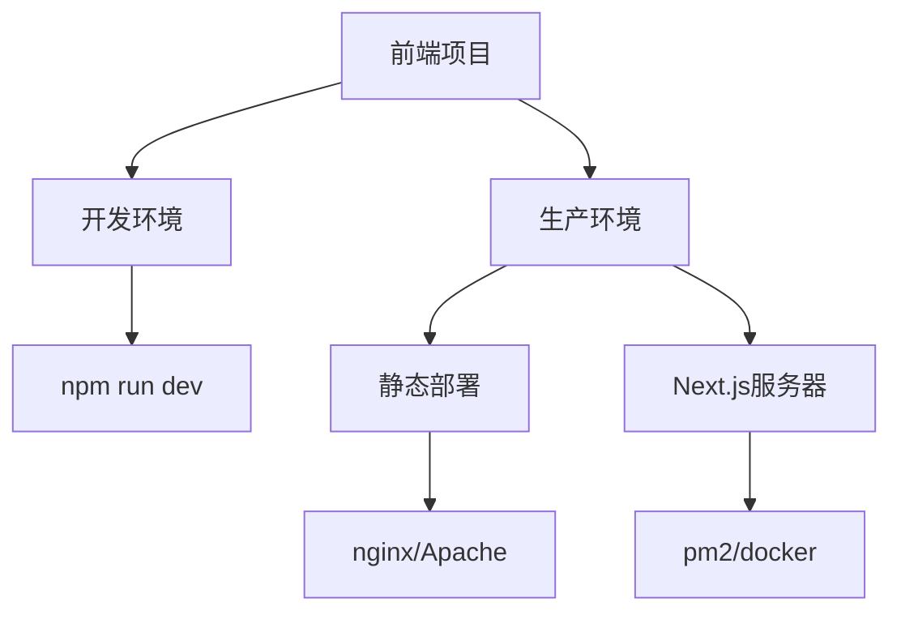

# Super Agent Frontend

基于 Next.js 的独立前端项目，提供账户总览等功能。

> ⚠️ **注意**: 此项目已从Maven多模块项目中分离，现在是独立的Node.js前端项目，支持独立开发和部署。

## 🛠️ 技术栈

- **框架**: Next.js 14.2.5
- **语言**: TypeScript
- **UI库**: Ant Design 5.x
- **样式**: CSS-in-JS (Ant Design)
- **HTTP客户端**: Axios
- **日期处理**: Day.js
- **图表**: Recharts (预留)

## 📋 功能特性

- 🏠 **账户总览**: 用户信息、积分统计、交易记录
- 📱 **响应式设计**: 支持桌面和移动端
- 🌐 **国际化**: 中文界面
- 🎨 **主题定制**: 基于 Ant Design 主题系统
- 🔄 **API集成**: 与 Spring Boot 后端无缝对接

## 🚀 快速开始

### 开发环境

1. **安装依赖**
   ```bash
   cd super-agent-frontend
   npm install
   ```

2. **启动开发服务器**
   ```bash
   npm run dev
   ```

3. **访问应用**
   - 开发地址: http://localhost:3000
   - 后端API代理: http://localhost:8081/super-agent/api

### 生产构建

```bash
# 构建前端应用
npm run build

# 启动生产服务器
npm start
```

## 📁 项目结构

```
super-agent-frontend/
├── src/
│   ├── components/          # React组件
│   │   └── AccountOverview.tsx
│   ├── pages/              # Next.js页面
│   │   ├── _app.tsx        # 应用配置
│   │   ├── _document.tsx   # HTML文档
│   │   └── index.tsx       # 首页
│   ├── services/           # API服务
│   │   └── api.ts
│   ├── types/              # TypeScript类型定义
│   │   └── user.ts
│   └── utils/              # 工具函数
│       └── format.ts
├── public/                 # 静态资源
├── out/                    # 构建输出（静态导出）
├── package.json
├── next.config.js          # Next.js配置
├── tsconfig.json           # TypeScript配置
└── pom.xml                 # Maven配置
```

## 🔧 配置说明

### Next.js 配置 (next.config.js)

- **静态导出**: 适配Spring Boot静态资源服务
- **基础路径**: 生产环境自动添加 `/super-agent` 前缀
- **API代理**: 开发环境自动代理到后端
- **优化配置**: 压缩、Tree Shaking等

### 独立部署

前端项目现在完全独立于后端Maven项目：

1. **开发环境**: 独立启动，通过代理访问后端API
2. **生产环境**: 可部署到任意静态服务器或使用Next.js服务器
3. **容器化**: 支持Docker化部署

### 部署选项



## 🌍 环境变量

创建 `.env.local` 文件：

```bash
# API基础URL
NEXT_PUBLIC_API_BASE_URL=http://localhost:8081/super-agent

# 是否启用模拟数据
NEXT_PUBLIC_USE_MOCK_DATA=true

# 应用信息
NEXT_PUBLIC_APP_TITLE=Super Agent
NEXT_PUBLIC_APP_VERSION=1.0.0
```

## 📡 API 集成

### 开发模式

- 前端: http://localhost:3000
- 后端: http://localhost:8081
- API代理: `/api/*` → `http://localhost:8081/super-agent/api/*`

### 生产模式

- 集成部署: http://localhost:8081/super-agent
- 静态资源: 由Spring Boot提供
- API调用: 相对路径 `/super-agent/api/*`

## 🎨 UI组件

基于 Ant Design 的响应式组件：

- **统计卡片**: 积分信息展示
- **数据表格**: 交易记录列表
- **用户信息**: 头像、昵称、注册时间
- **状态标签**: 交易类型标识

## 🛠️ 开发指南

### 添加新页面

1. 在 `src/pages/` 创建新页面文件
2. 使用 TypeScript 和 React Hooks
3. 集成 Ant Design 组件
4. 添加适当的类型定义

### API调用

```typescript
import { userApi, creditApi } from '@/services/api';

// 获取用户积分
const credit = await creditApi.getUserCredit(userId);

// 获取交易记录
const transactions = await creditApi.getCreditTransactions(userId, 1, 10);
```

### 类型定义

所有ID字段使用 `string` 类型以避免JavaScript精度丢失：

```typescript
export interface UserInfo {
  id: string;        // 而非 number
  username: string;
  // ...
}
```

## 🔍 调试

- **开发工具**: React Developer Tools
- **网络请求**: Chrome DevTools Network
- **构建分析**: `npm run build` 查看打包信息
- **类型检查**: `npm run type-check`

## 📝 注意事项

1. **ID类型**: 前端使用 `string` 类型避免精度丢失
2. **路径配置**: 生产环境需要配置正确的 `basePath`
3. **API代理**: 开发环境确保后端服务已启动
4. **静态资源**: 图片等资源放在 `public/` 目录

## 🚀 部署

### Maven 构建部署

```bash
# 完整构建
mvn clean package -P prod

# 启动应用
java -jar super-agent-boot/target/super-agent-boot.jar

# 访问前端
http://localhost:8081/super-agent/
```

### 独立部署 (可选)

```bash
# 构建静态文件
npm run build

# 部署 out/ 目录到任意静态服务器
```

## 🤝 贡献

1. Fork 项目
2. 创建功能分支
3. 提交变更
4. 推送到分支
5. 创建 Pull Request

## 📄 许可证

MIT License
